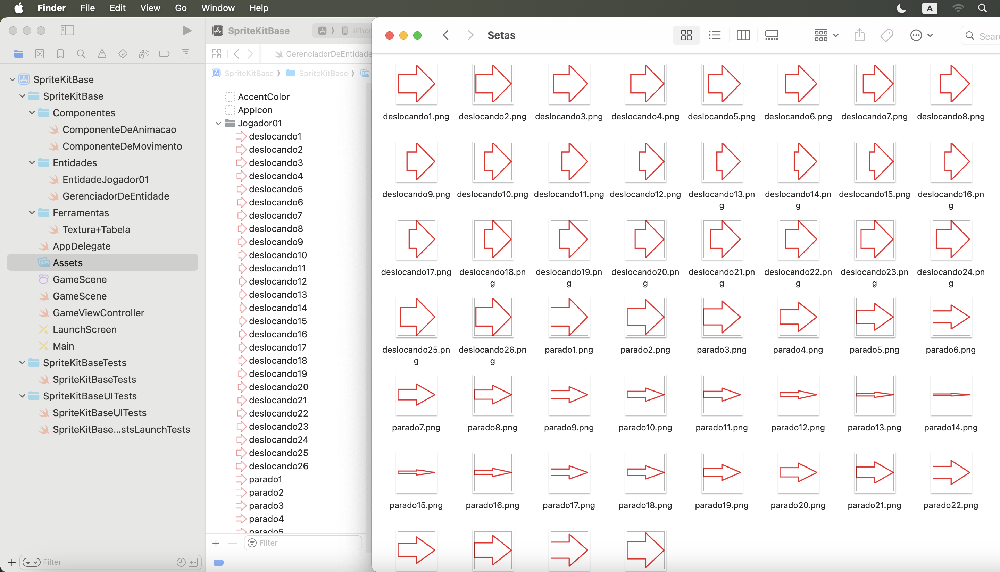
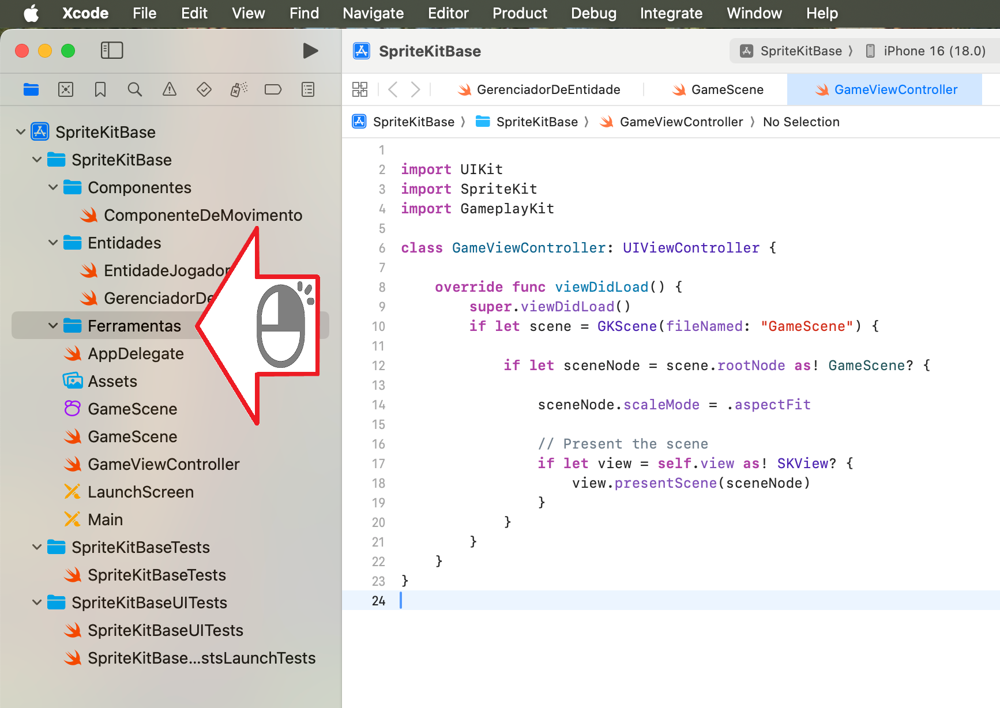
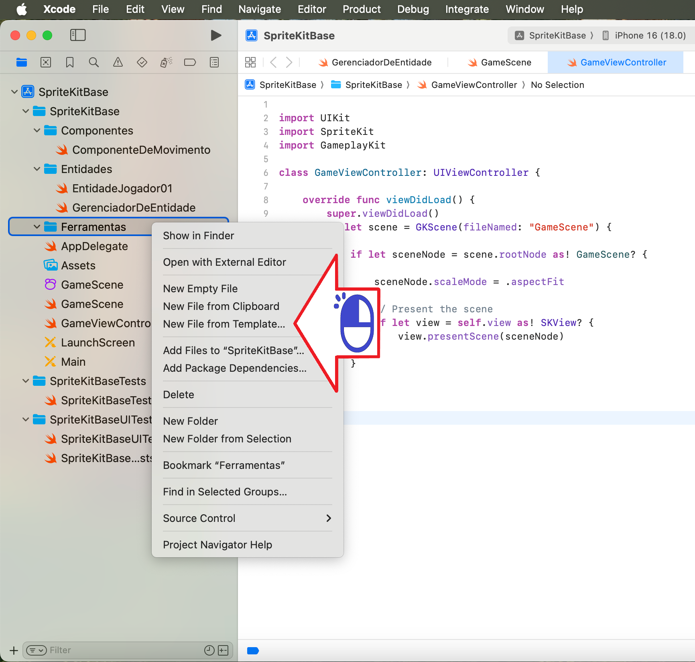
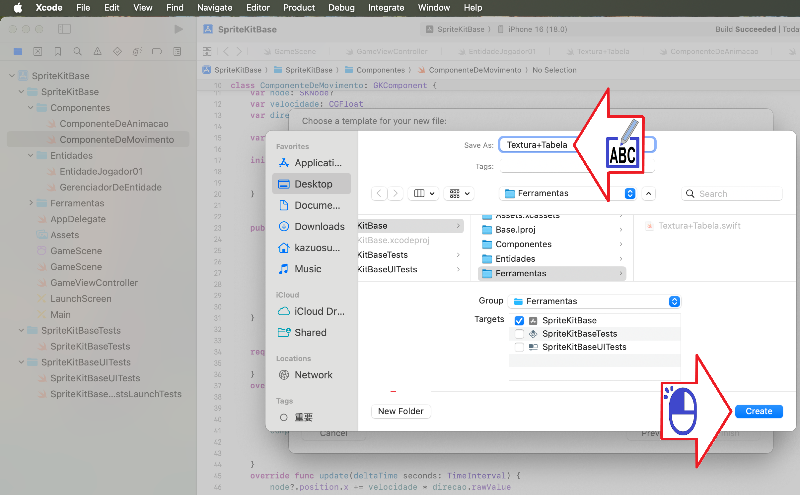
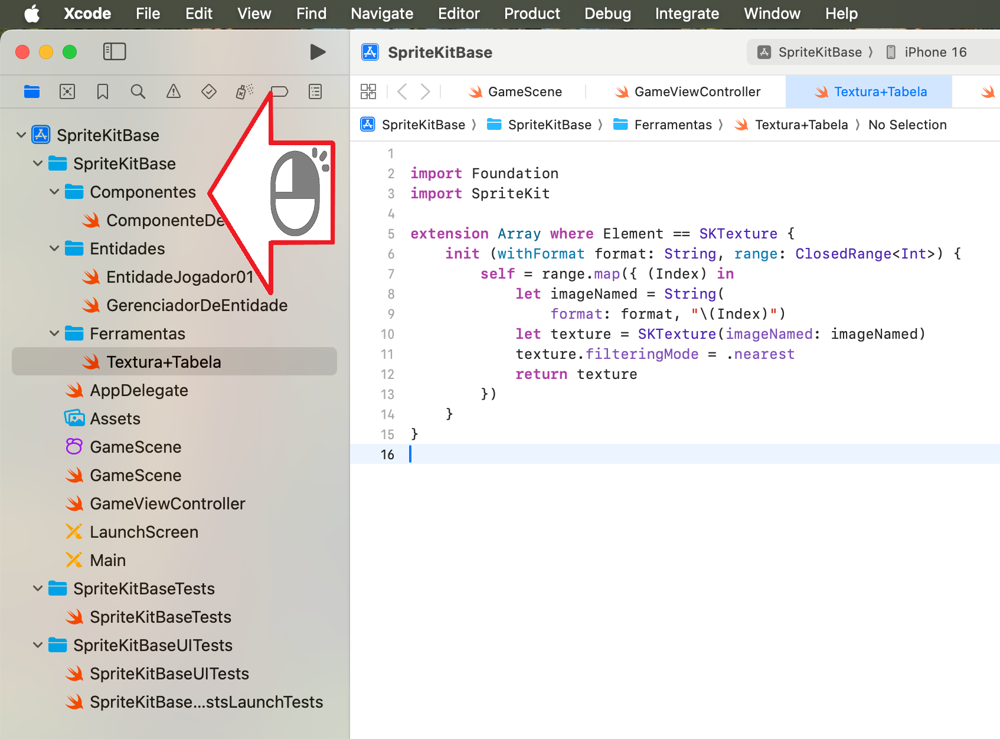
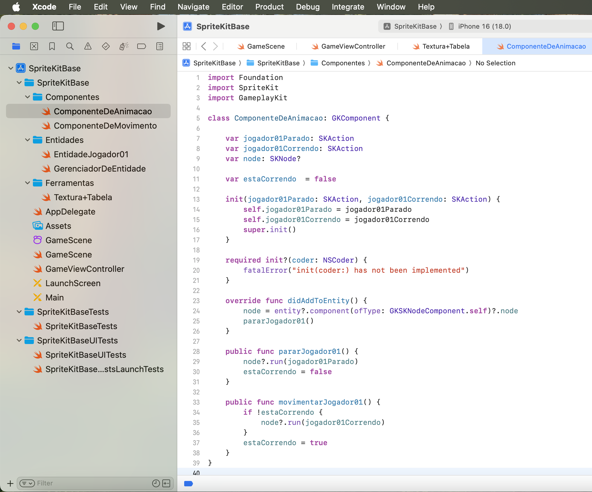
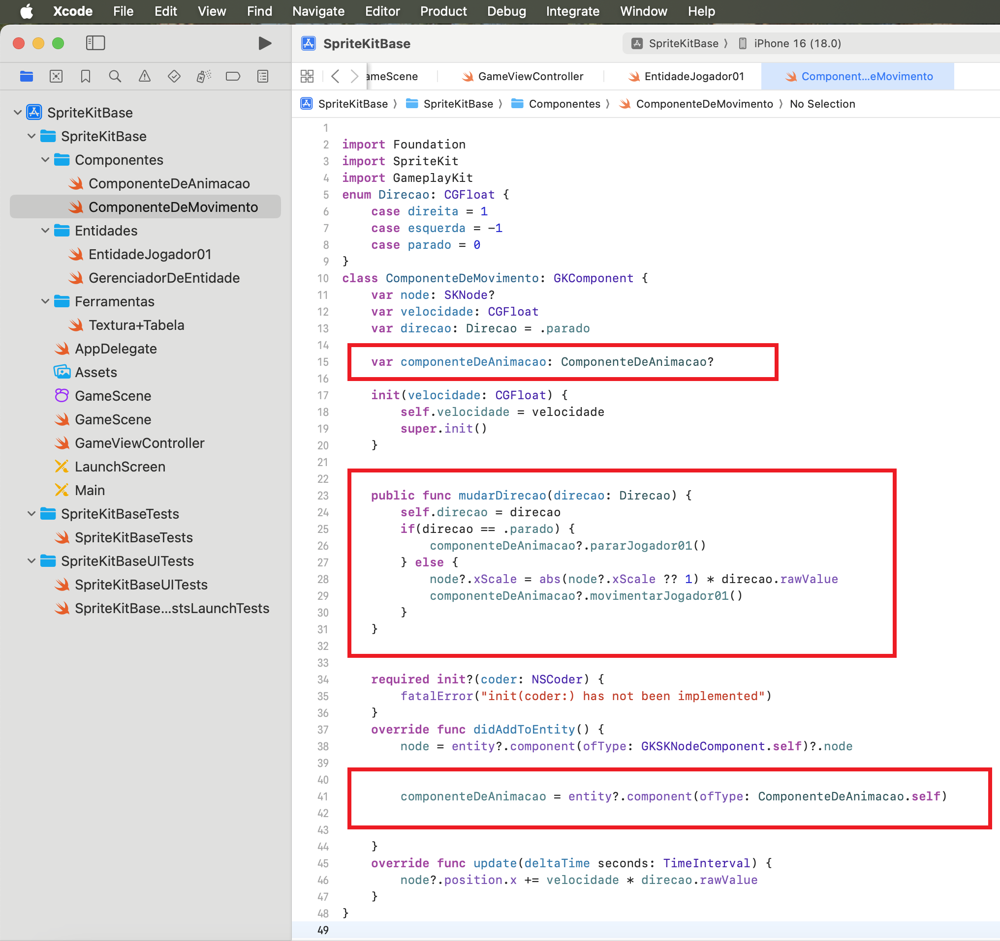

# SpriteKit Animation

Criando animação no SpriteKit

Figura 01

Figura 02

Figura 03

Figura 04

Figura 05

Figura 06

Figura 07

Figura 08

Figura 09

Figura 10

Figura 11

Figura 12

Figura 13

Figura 14

Figura 15

Figura 16

Figura 17

Figura 18

Figura 19

Figura 20

Figura 21

