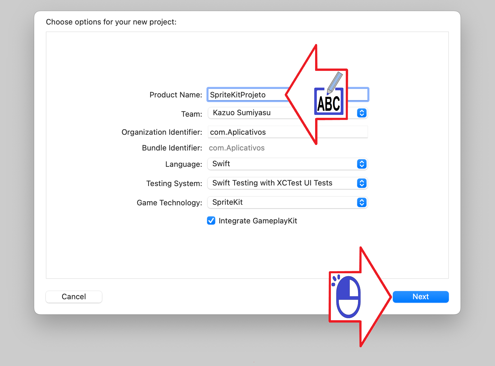
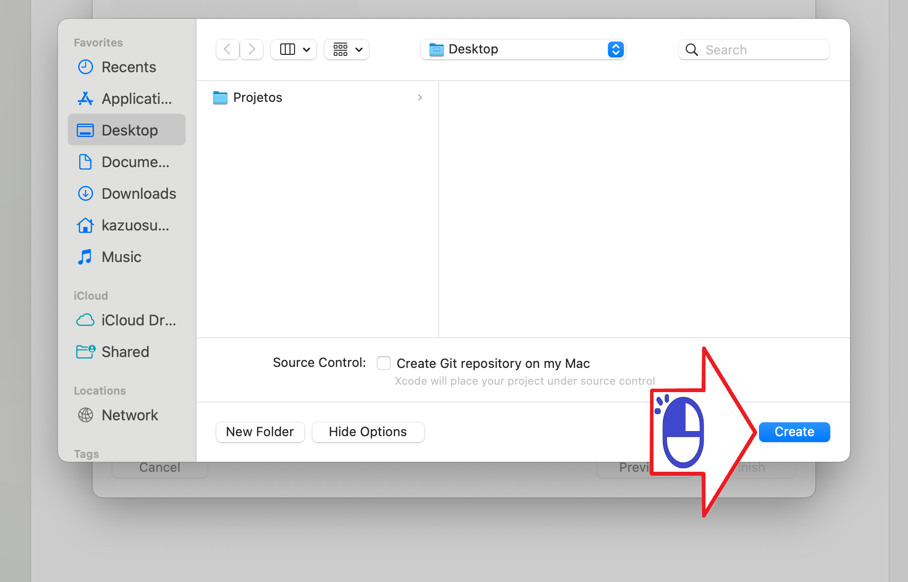

# Configuração do Xcode

Configurando o Xcode para usar o SpriteKit

Figura 01 - Versão do Xcode

Figura 02 - Abra um novo projeto

Figura 03 - Escolha App para seu projeto

Figura 04 - Escolha Swift como linguagem

Figura 05 - Crie seu projeto

