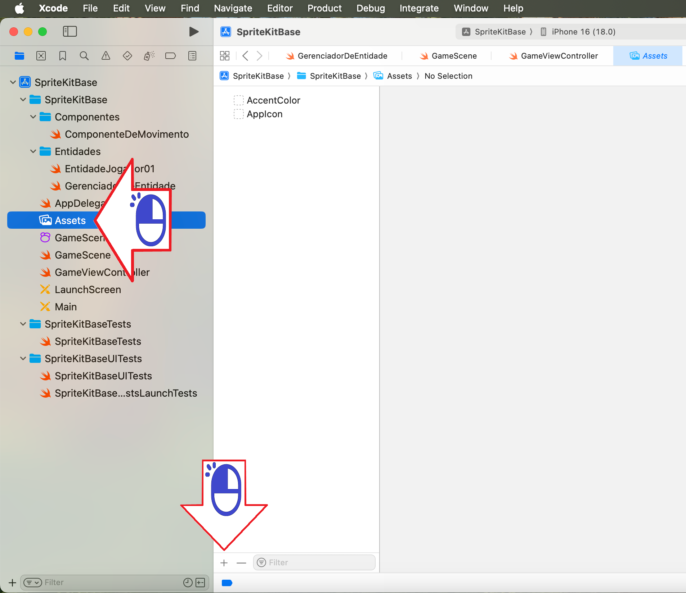
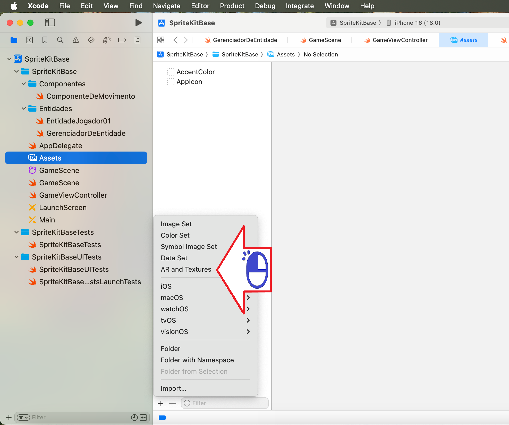
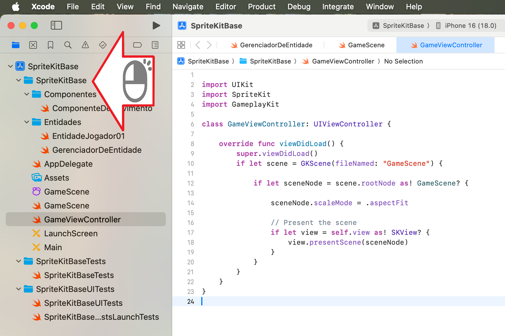
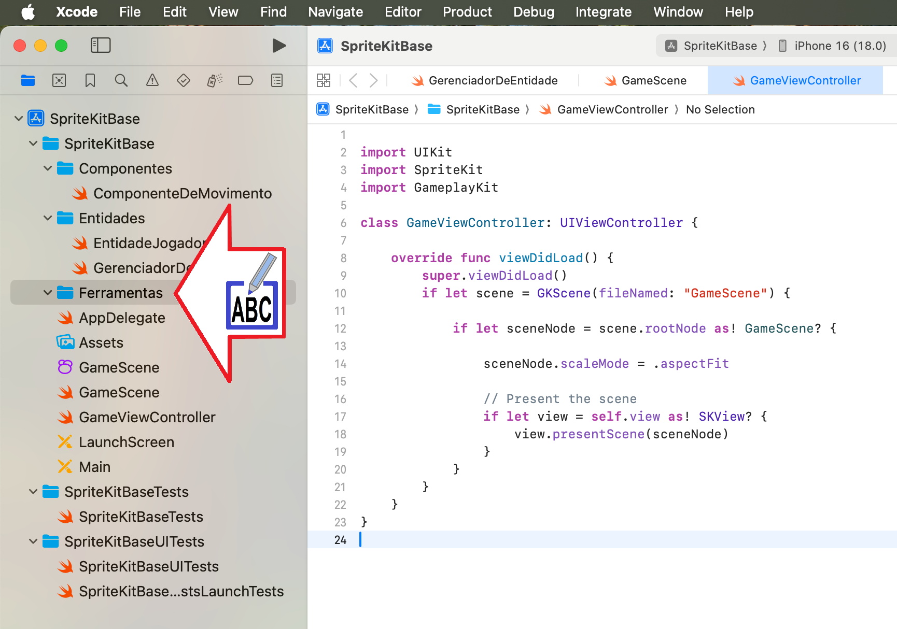
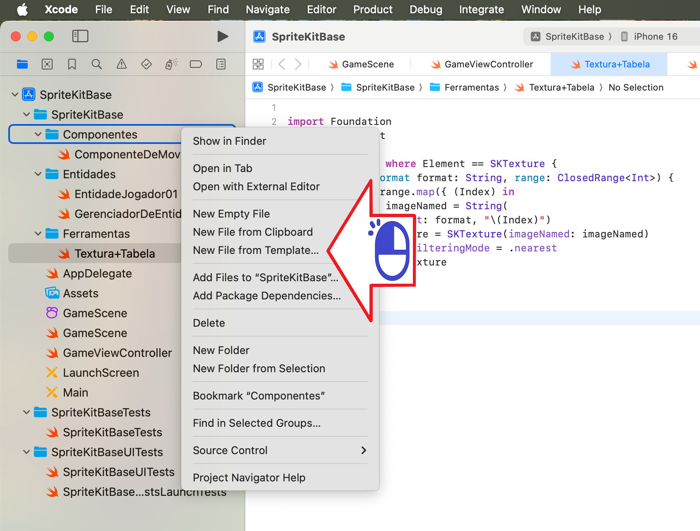
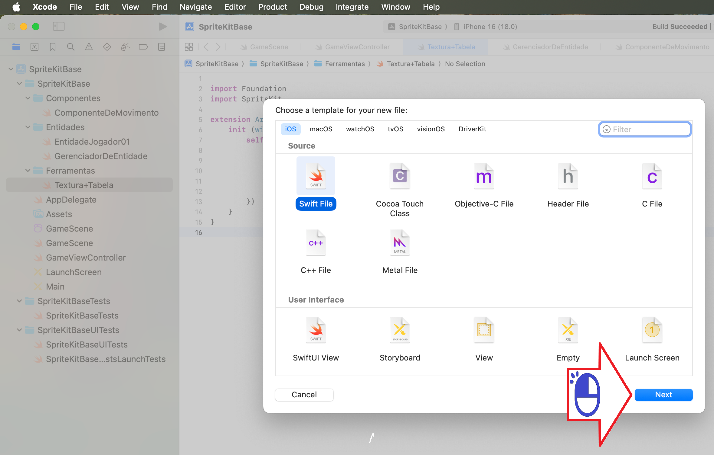
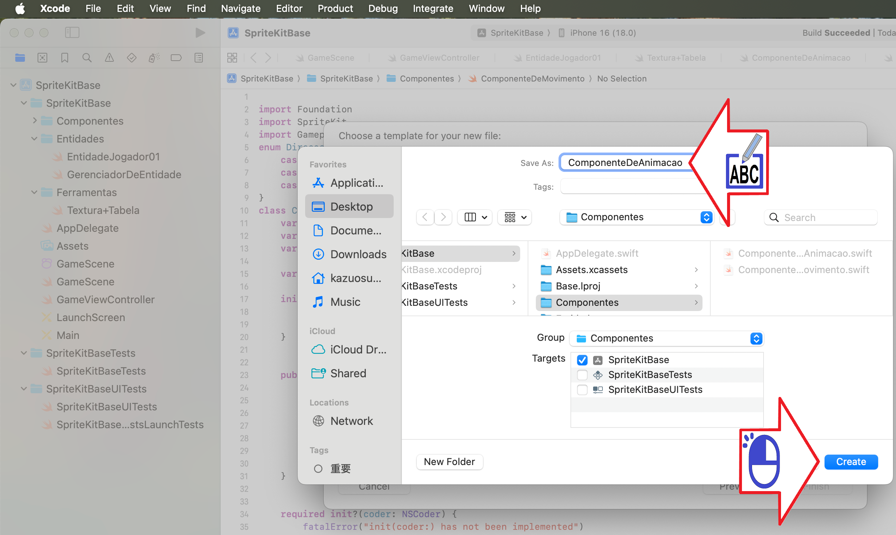
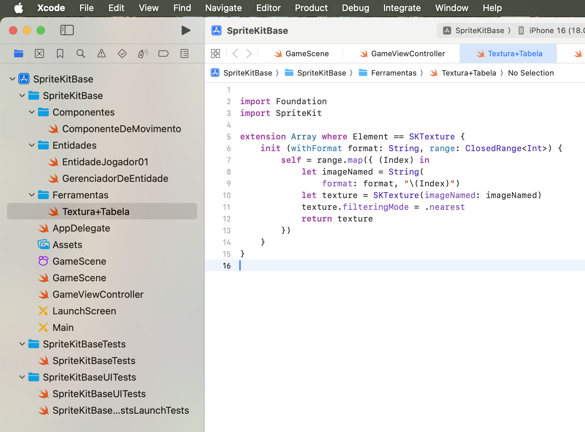
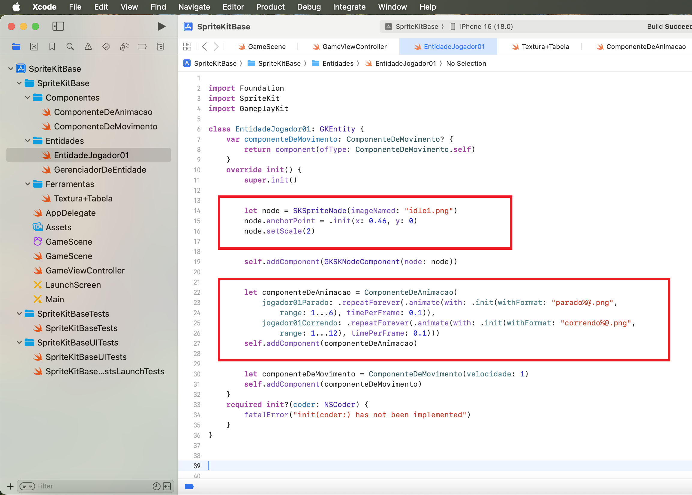

# SpriteKit Tile

Como colocar superficie no SpriteKit

Figura 01

Figura 02

Figura 03

Figura 04

Figura 05

Figura 06

Figura 07

Figura 08

Figura 09

Figura 10

Figura 11

Figura 12

Figura 13

Figura 14

Figura 15

Figura 16

Figura 17

Figura 18

Figura 19

Figura 20

Figura 21

Figura 22

Figura 23

Figura 24

Figura 25

Figura 26

Figura 27

Figura 28

Figura 29

Figura 30

Figura 31

Figura 32

Figura 33

Figura 34

Figura 35

Figura 36

Figura 37

