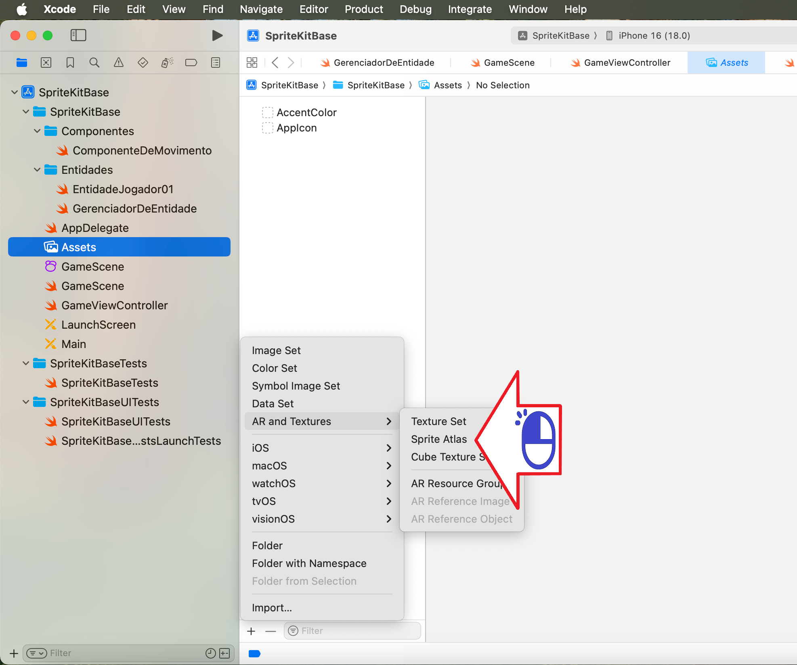
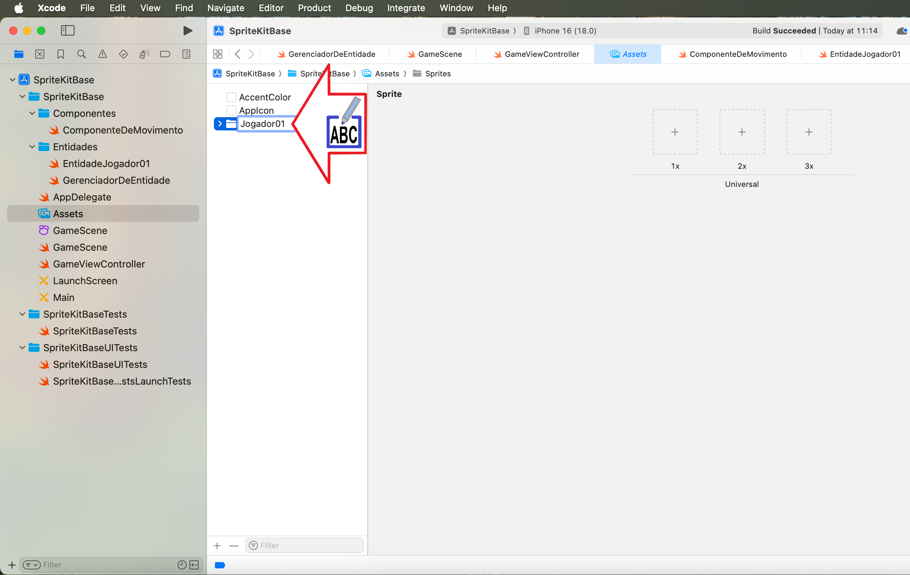
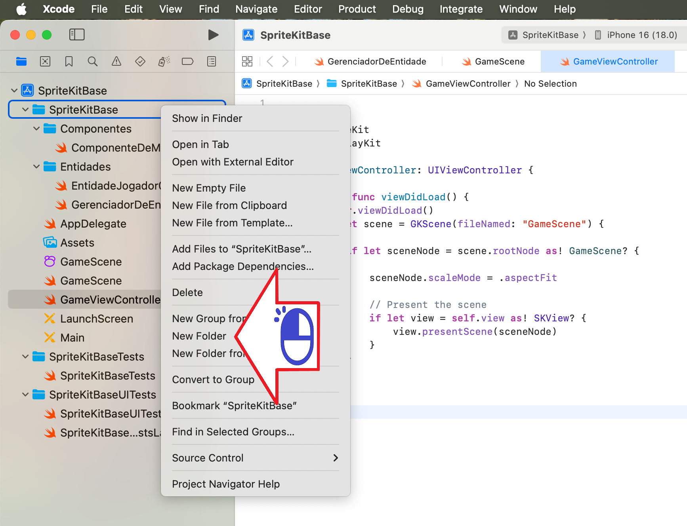

# スプライトキットタイル

スプライトキットにサーフェスを配置する

絵 01

絵 02

絵 03

絵 04

絵 05

絵 06

絵 07

絵 08

絵 09

絵 10

絵 11

絵 12

絵 13

絵 14

絵 15

絵 16

絵 17

絵 18

絵 19

絵 20

絵 21

絵 22

絵 23

絵 24

絵 25

絵 26

絵 27

絵 28

絵 29

絵 30

絵 31

絵 32

絵 33

絵 34

絵 35

絵 36

絵 37

