# Configuração do Som
 
Configurando o NSObject AVFoundation

Figura 01

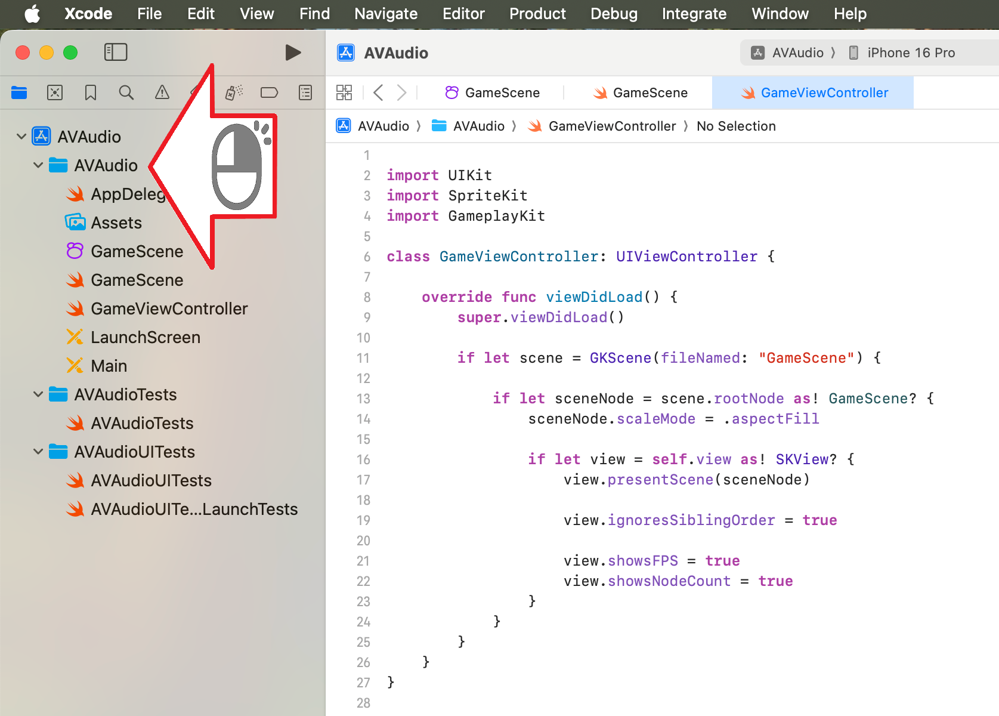

Figura 02

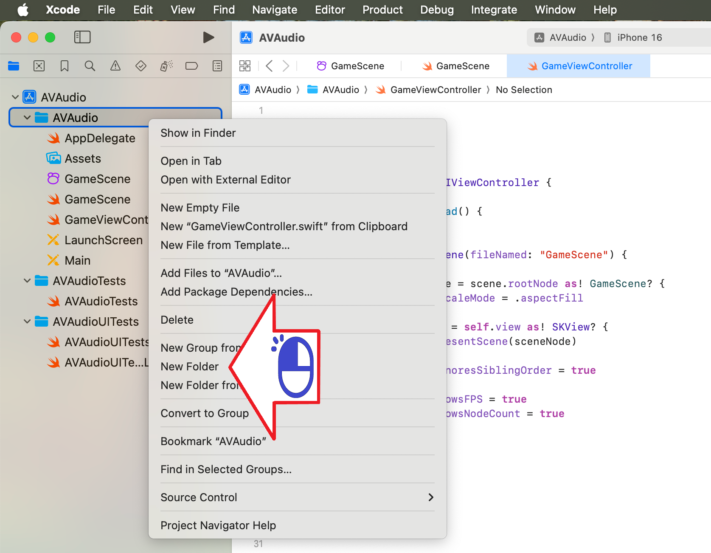

Figura 03

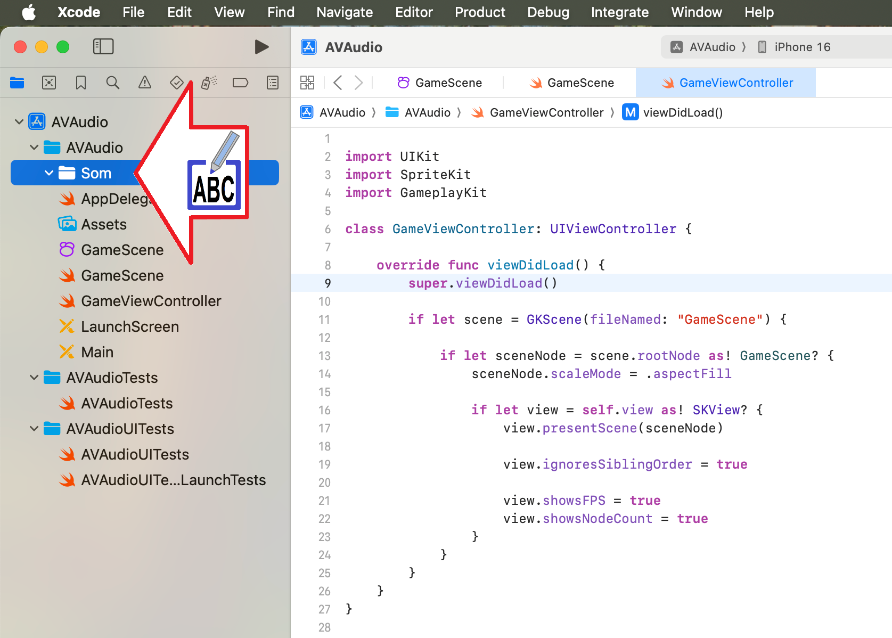

Figura 04

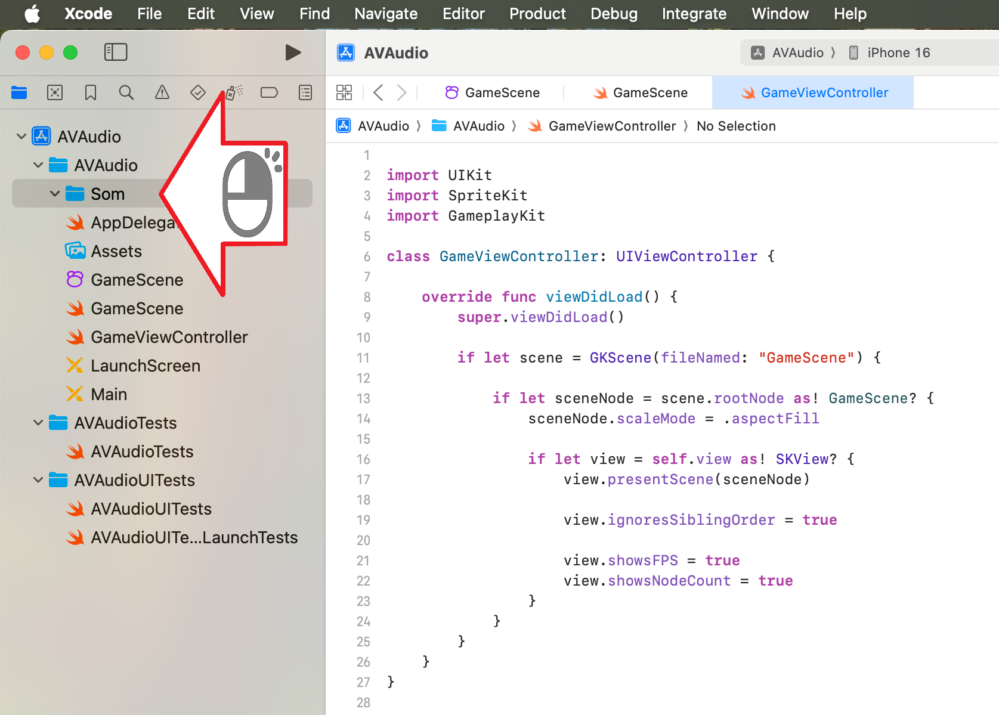

Figura 05

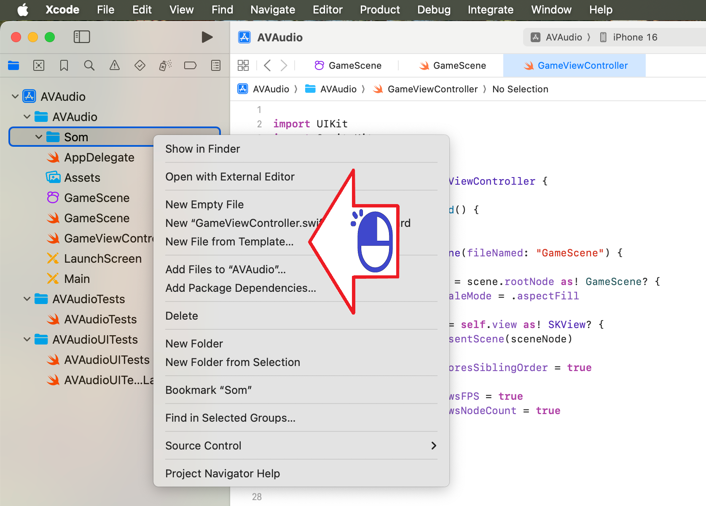

Figura 06

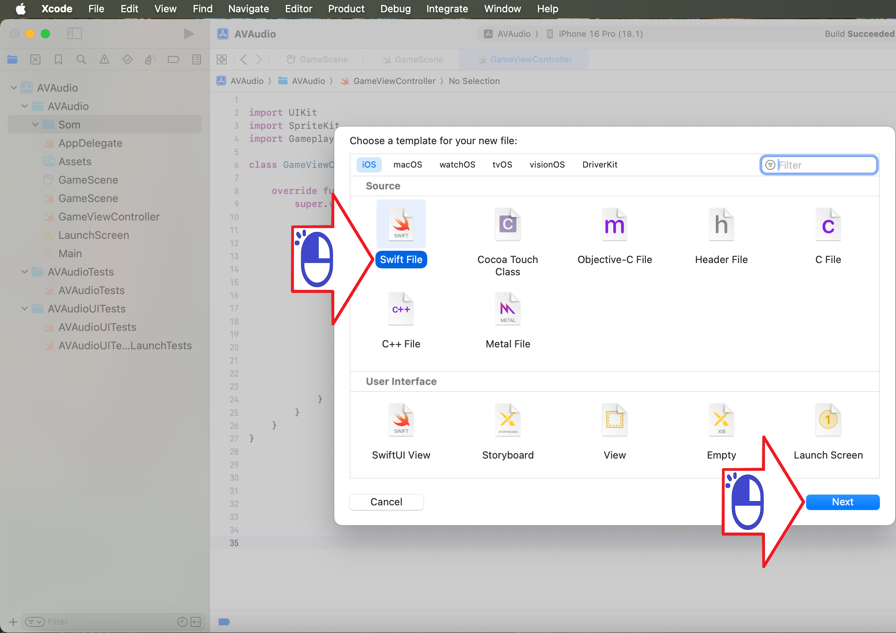

Figura 07

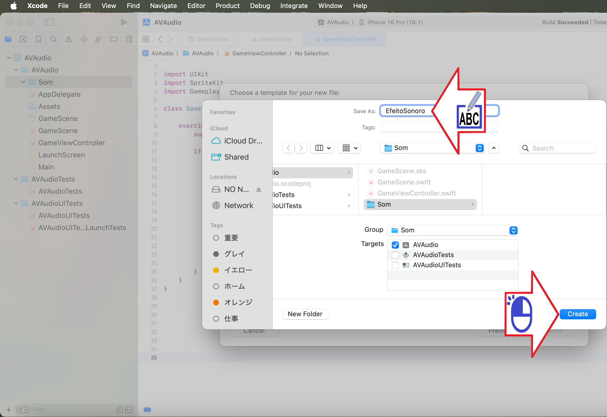

Figura 08

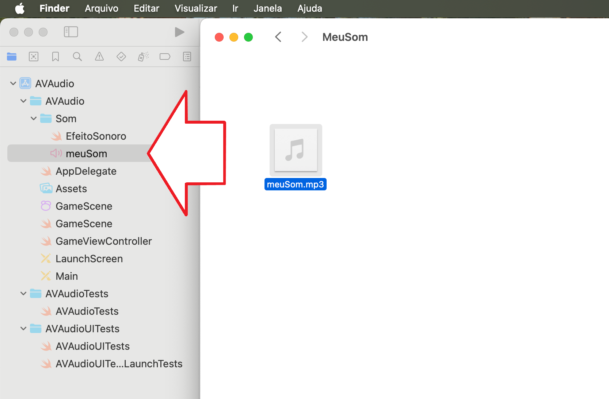

Figura 09

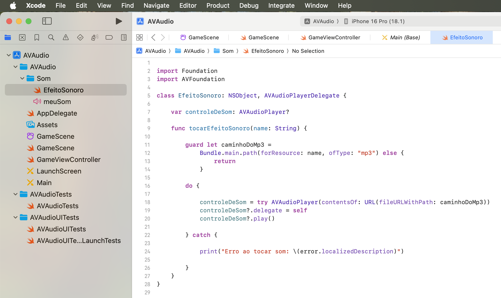

Figura 10

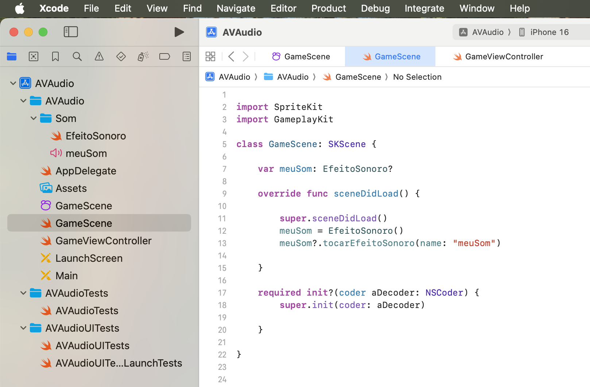

Figura 11

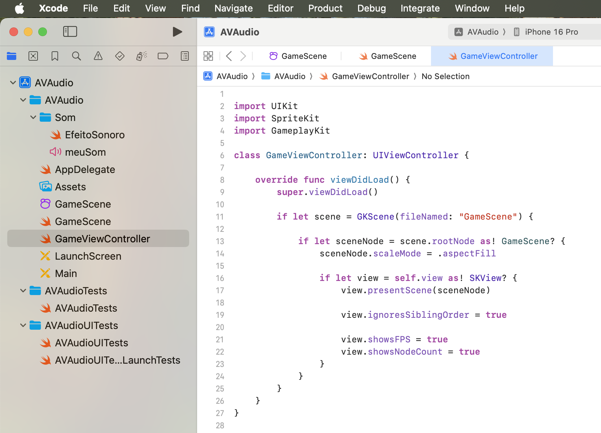