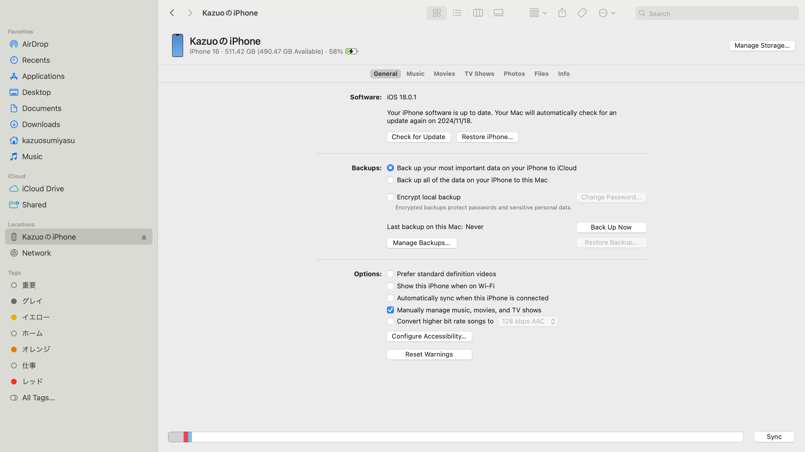
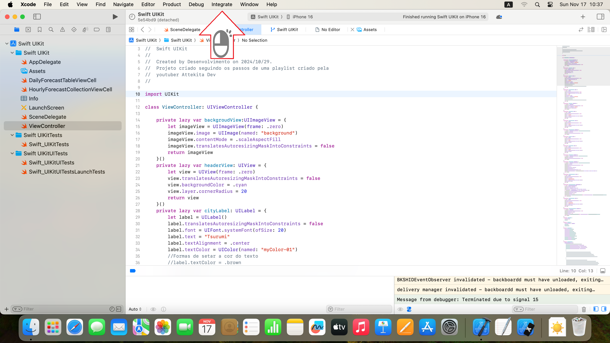
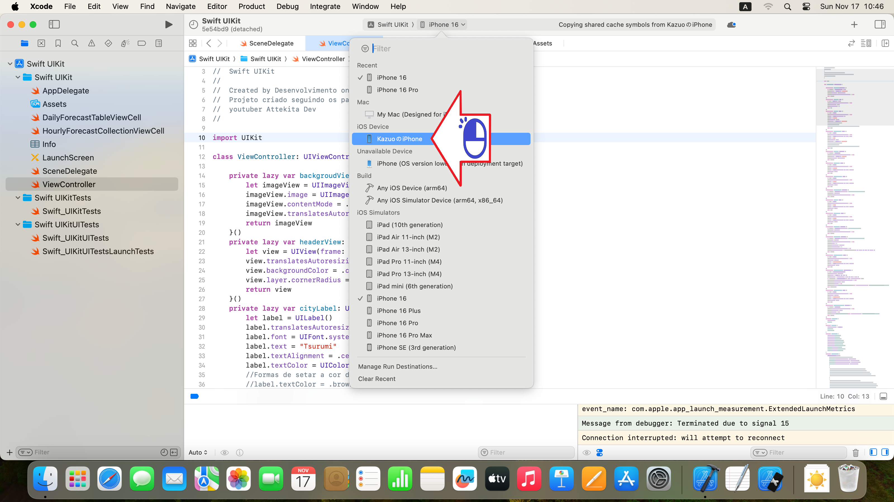

# Conexao do iPhone

Conectando o iPhone ao Xcode no Mac

Figura 01 - Conecte o iPhone ao Mac via USB

Figura 02 - Clique o direito em Integrate

Figura 03 - Clique em Device e Simuladores

Figura 04 - Selecione o aparelho iPhone

