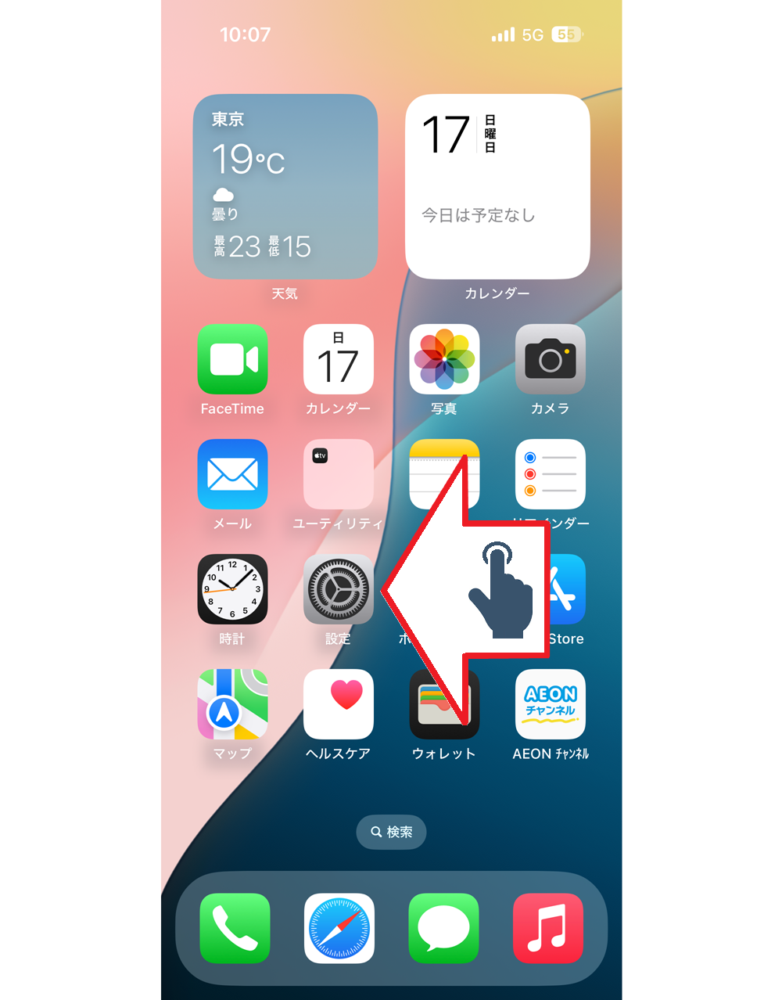
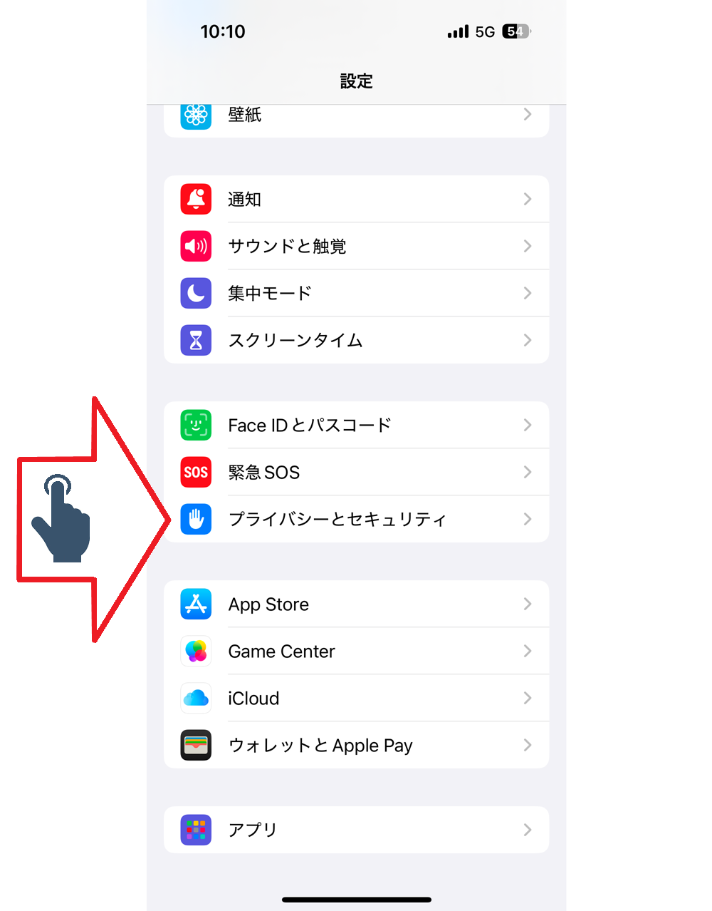
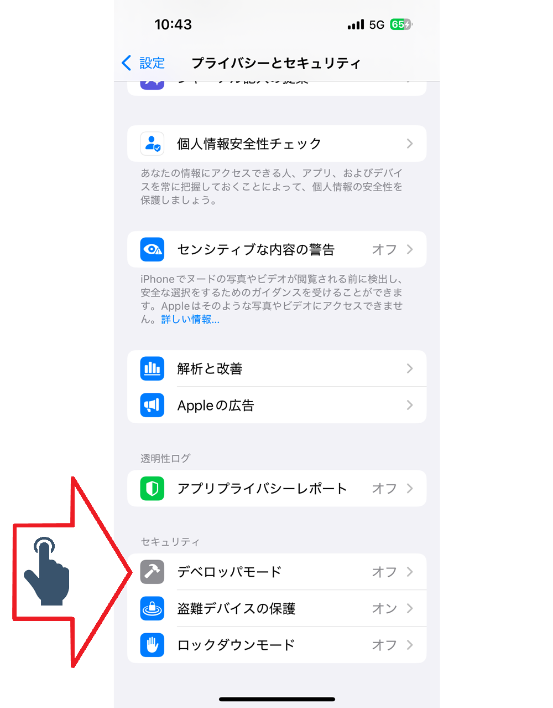
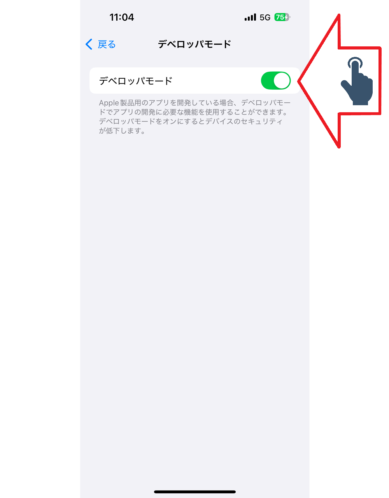

# Configuração do iPhone

Configurando o iPhone modo desenvolvedor

Figura 01 - Toque configurações

Figura 02 - Toque Privacidade e Segurança

Figura 03 - Toque modo Desenvolvedor

Figura 04 - Toque on para habilitar modo

