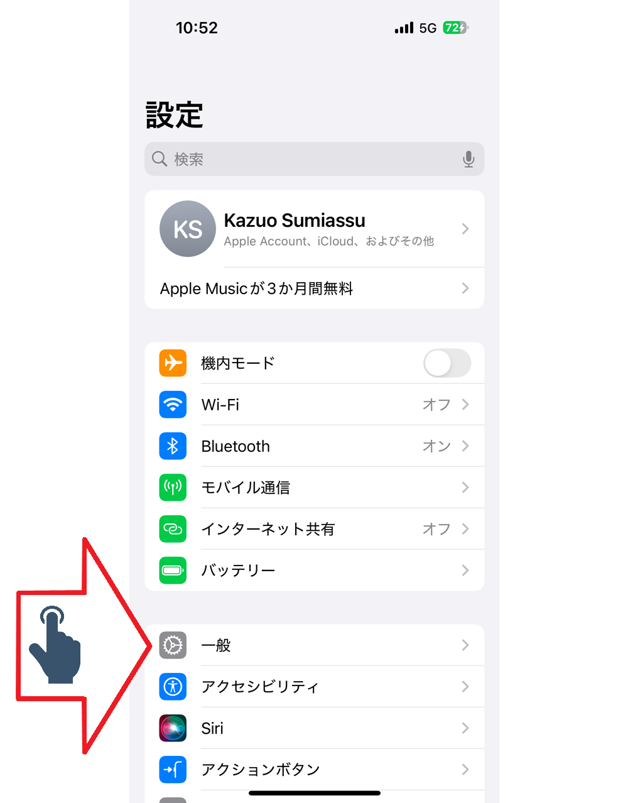
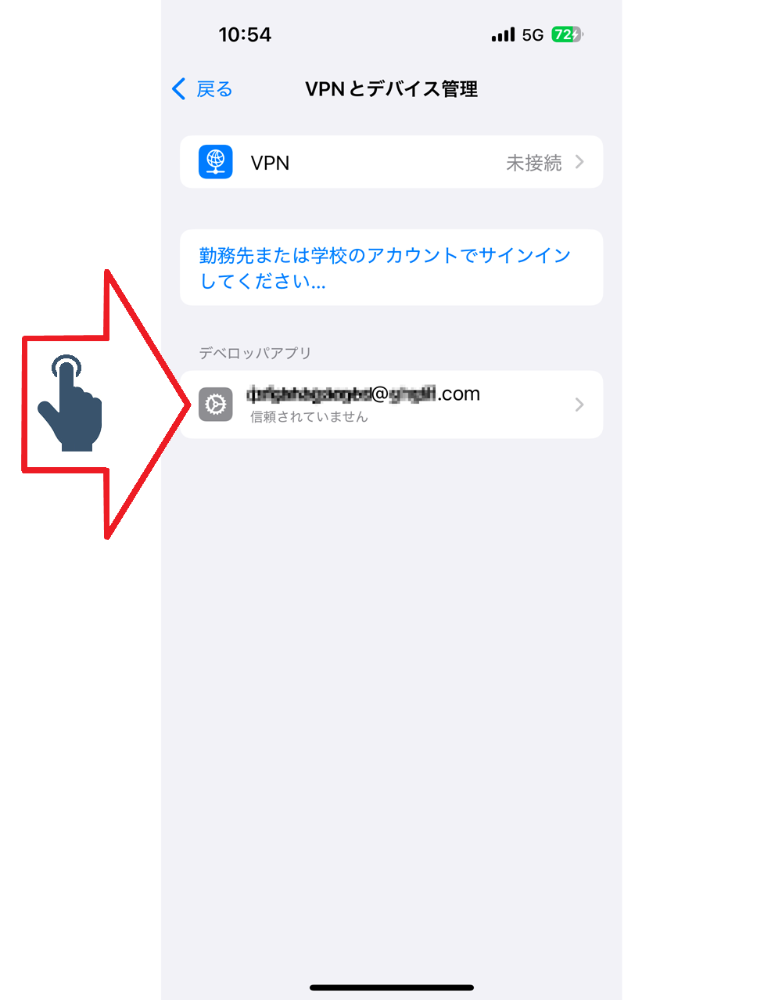
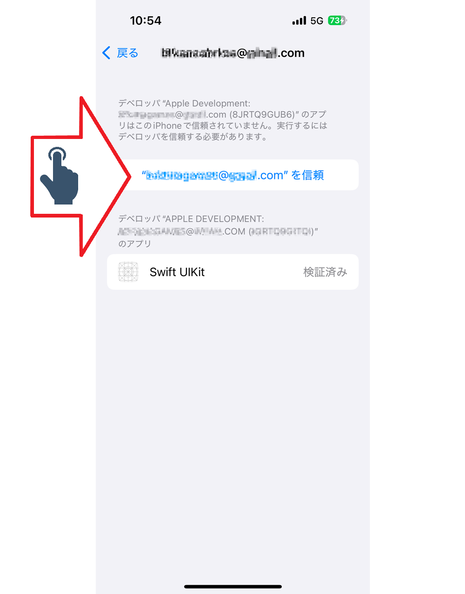

# Permissão para instalar

Opção para permitir a instalação de projetos no iPhone

Figura 01 - Toque configurações

Figura 02 - Toque configurações

Figura 03 - Toque VPN e Devices

Figura 04 - Toque no pedido de permissão

Figura 05 - Recebendo a permissão

